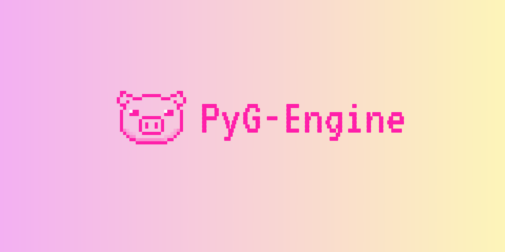

# PyG Engine

A Python game engine built on **Rust** and **WebGPU (wgpu)** with GPU rendering enabled <u>*by default*</u>

PyG Engine combines the ease of use of Python with the raw performance and safety of Rust. It leverages `wgpu` for modern, hardware-accelerated rendering across all major platforms (Vulkan, DirectX 12, Metal, OpenGL).

> **NOTE:** This project is currently in **Alpha**. Features are under active development.

## 🚀 Key Features

*   **Modern Rendering**: Powered by **wgpu** for cross-platform, high-performance graphics.
*   **Rust Core**: The heavy lifting is done in Rust, ensuring speed and memory safety.
*   **Pythonic API**: Designed to feel natural for Python developers.
*   **Immediate Mode Drawing**: Easily draw lines, rectangles, circles, and pixels using pixel coordinates.
*   **Mesh System**: Render textured quads and game objects with a component-based architecture (using normalized coordinates).
*   **Thread Safety**: Unique `EngineHandle` system allows you to safely issue rendering commands from background Python threads.
*   **Robust Logging**: Integrated tracing-based logging system with file support and configurable levels.

## 📚 Documentation

- **[API Reference](https://aram-ap.github.io/pyg_engine/)** - Complete Python API documentation (auto-generated from docstrings)
- **[Logging Guide](LOGGING_GUIDE.md)** - Comprehensive guide to the logging system
- **[Examples](examples/README.md)** - Collection of example projects and demos

## 📦 Installation

Requires **Python 3.7+**.

### From PyPI (Coming Soon)
```bash
pip install pyg-engine
```

### From Source
```bash
git clone https://github.com/aram-ap/pyg-engine.git
cd pyg-engine
pip install -e .
```

## ⚡ Quick Start

### 1. Basic Window & Logging
```python
import pyg_engine as pyg

# Initialize the engine
engine = pyg.Engine(log_level="INFO")
engine.log_info("Welcome to PyG Engine!")

# Run a window (blocks until closed)
engine.run(title="My First Window", width=800, height=600)
```

### 2. Drawing Primitives (Pixel Coordinates)
```python
import pyg_engine as pyg

engine = pyg.Engine()

# Draw a cyan line
engine.draw_line(20, 20, 220, 80, pyg.Color.CYAN, thickness=2.0)

# Draw an orange rectangle outline
engine.draw_rectangle(60, 120, 180, 90, pyg.Color.ORANGE, filled=False, thickness=3.0)

# Draw text (built-in font by default)
engine.draw_text("Hello PyG", 32, 48, pyg.Color.WHITE, font_size=28.0)

# Start the application
engine.run(title="Direct Draw Demo", show_fps_in_title=True)
```

### 3. Using Game Objects & Meshes (Normalized Coordinates)
```python
import pyg_engine as pyg

engine = pyg.Engine()

# Create a Game Object
go = pyg.GameObject("Player")

# Add a Mesh Component
mesh = pyg.MeshComponent("PlayerSprite")
mesh.set_geometry_rectangle(1.0, 1.0) # 1.0 width/height in normalized units
mesh.set_fill_color(pyg.Color.RED)
# mesh.set_image_path("path/to/image.png") # Optional texture

go.set_mesh_component(mesh)

# Position is in Normalized Device Coordinates (NDC)
# (0,0) is center, (-1, -1) bottom-left, (1, 1) top-right
go.position = pyg.Vec2(0.0, 0.0)
go.scale = pyg.Vec2(0.5, 0.5)

engine.add_game_object(go)

engine.run(title="Game Object Demo")
```

### 4. Function-Based Update Loop
```python
import pyg_engine as pyg

engine = pyg.Engine()

def update(dt, engine, frame):
    if engine.input.key_pressed(pyg.Keys.ESCAPE):
        return False
    engine.clear_draw_commands()
    # draw/update game state...

engine.run(
    title="Callback Loop",
    show_fps_in_title=True,
    update=update,
    max_delta_time=0.1,
)
```

`run(update=...)` supports callbacks with no arguments, a single
`context` argument, or named argument injection (`dt`, `engine`, `input`,
`elapsed_time`, `frame`, `user_data`).

For fully manual loop control, use `start_manual(...)` then drive
`poll_events()`, `update()`, and `render()` yourself.
The callback acts as a global frame hook; planned per-GameObject scripts are
intended to run in the engine update phase before this global callback.
Runtime guard: calling `run(...)`/`start_manual(...)` while another loop is active
raises `RuntimeError`.

## 🔧 Architecture & Roadmap

### Current Capabilities
- **Window Management**: Resizable windows, VSync control, Fullscreen support.
- **2D Rendering**:
    - **Primitives**: Immediate mode drawing using pixel coordinates.
    - **Text**: Built-in open-source font rendering with optional custom font files.
    - **Meshes**: Component-based rendering using normalized device coordinates.
    - **Layers**: Z-indexing and integer layering for draw order control.
- **Component System**: Basic `GameObject` with `TransformComponent` and `MeshComponent`.
- **Input System**: Rust input manager (Keyboard, Mouse, Gamepad) to Python.
- **Loop Control**: `run(...)` with optional callback and explicit `start_manual(...)` mode.

### Planned Features (Roadmap)
- **Audio Manager**: Audio loading, playback, mixing, and timing.
- **World-Based Camera**: A straightforward method for keeping your game objects in frame.
- **Engine Loop (Upgrade)**: Coroutines and global event systems.
- **Physics Engine**: 2D rigid body physics and collision detection.
- **Scripting**: Enhanced script attachment to GameObjects with frame-lifecycle hooks.
- **UI System**: Built-in UI components.
- **Additional Primitives**: Added capabilities for more basic shapes, arcs, SVGs, and function-based shapes.
- **Advanced Rendering**: Shaders, Particles, and Post-processing.

## 📂 Examples

Check the `examples/` directory for more complete demonstrations:

- `python_direct_draw_demo.py`: Shows how to draw basic shapes (pixels, lines, rects).
- `python_mesh_demo.py`: Demonstrates the GameObject and Mesh system.
- `python_threading_demo.py`: **Advanced**: Spawns a background thread that safely updates the UI using `engine.get_handle()`.
- `python_manual_loop.py`: Shows how to control the game loop manually (`start_manual` -> poll -> update -> render).
- `python_function_update_demo.py`: Shows callback-based loop control via `engine.run(update=...)`.
- `python_snake_demo.py`: Playable Snake game using immediate-mode drawing and keyboard input.

## 🛠️ Development & Testing

To set up the development environment:

```bash
# Install in editable mode
pip install -e .

# Run tests
pytest tests/ -v
```

## 📄 License

MIT License
