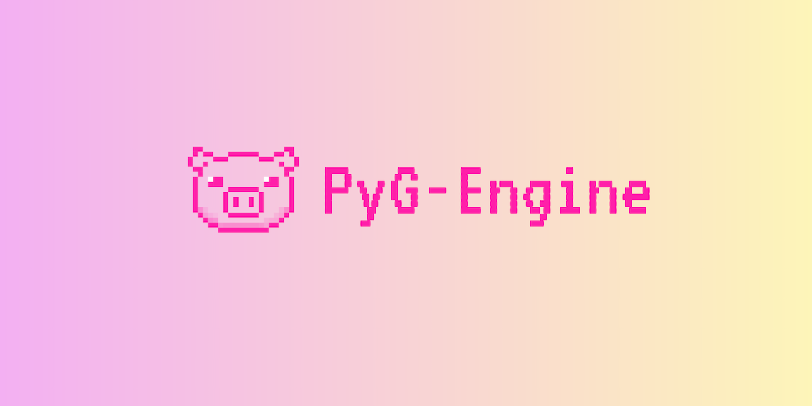
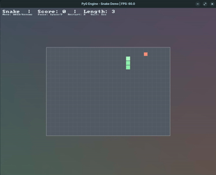

# PyG Engine

A Python game engine built on **Rust** and **WebGPU (wgpu)** with GPU rendering enabled <u>*by default*</u>

PyG Engine combines the ease of use of Python with the raw performance and safety of Rust. It leverages `wgpu` for modern, hardware-accelerated rendering across all major platforms (Vulkan, DirectX 12, Metal, OpenGL).

> **NOTE:** This project is currently in **Alpha**. Features are under active development.

## :rocket: Key Features

*   **Modern Rendering**: Powered by **wgpu** for cross-platform, high-performance graphics.
*   **Rust Core**: The heavy lifting is done in Rust, ensuring speed and memory safety.
*   **Measured Performance Gain**: In the fixed `1920x1080` benchmark workload, `pyg_engine` runs at about **2.26x** the FPS of `pygame` (see **Benchmarks** below).
*   **Pythonic API**: Designed to feel natural for Python developers.
*   **Flexible Drawing**: Easily draw lines, rectangles, circles, and pixels using pixel coordinates.
*   **Mesh System**: Render textured quads and game objects with a component-based architecture (using normalized coordinates).
*   **Thread Safety**: Safely issue rendering commands from background Python threads.
*   **Robust Logging**: Integrated tracing-based logging system with file support and configurable levels.
*   **UI Components**: Built in UI components built with extendability and custom styling. Easy callback function implementations included for buttons.
*   **Unified Input System**: Easily implement controls with an Axis system, keyboard macros, and event-based callback functions.

## :books: Documentation

- **[API Reference](https://aram-ap.github.io/pyg-engine/)** - Complete Python API documentation

## :eyes: Gallary

- **[Snake](examples/snake_demo.py)**: One of the provided examples



## :package: Installation

Requires **Python 3.7+**.

### From PyPI (Coming Soon)
```bash
pip install pyg-engine
```

### From Source
```bash
git clone https://github.com/aram-ap/pyg-engine.git
cd pyg-engine
pip install -e .
```

## :zap: Quick Start

### 1. Basic Window & Logging
```python
import pyg_engine as pyg

# Initialize the engine
engine = pyg.Engine(log_level="INFO")
engine.log_info("Welcome to PyG Engine!")

# Run a window (blocks until closed)
engine.run(title="My First Window", width=800, height=600)
```

### 2. Drawing Primitives (Pixel Coordinates)
```python
import pyg_engine as pyg

engine = pyg.Engine()

# Draw shape objects
engine.draw([
    pyg.Line(
        start=pyg.Vec2(20, 20),
        end=pyg.Vec2(220, 80),
        color=pyg.Color.CYAN,
        thickness=2.0,
    ),
    pyg.Rect(
        position=pyg.Vec2(60, 120),
        width=180,
        height=90,
        color=pyg.Color.ORANGE,
        filled=False,
        thickness=3.0,
    ),
    pyg.Arc(
        position=pyg.Vec2(320, 180),
        radius=42,
        start_angle=0.0,
        end_angle=3.8,
        color=pyg.Color.YELLOW,
        filled=False,
        thickness=5.0,
    ),
])

# Draw text as a shape object
engine.draw(
    pyg.Text(
        "Hello PyG",
        position=pyg.Vec2(32, 48),
        color=pyg.Color.WHITE,
        font_size=28.0,
    )
)

# Start the application
engine.run(title="Direct Draw Demo", show_fps_in_title=True)
```

### 3. Font Families And Styled Text
```python
import pyg_engine as pyg

engine = pyg.Engine()
engine.register_font_family(
    "inter",
    regular="assets/fonts/Inter-Regular.ttf",
    bold="assets/fonts/Inter-Bold.ttf",
    italic="assets/fonts/Inter-Italic.ttf",
    bold_italic="assets/fonts/Inter-BoldItalic.ttf",
)

engine.draw(
    pyg.Text(
        "Family font text",
        position=pyg.Vec2(32, 48),
        color=pyg.Color.WHITE,
        font_size=28.0,
        font_family="inter",
        font_weight="bold",
    )
)

width, height = engine.measure_text(
    "Menu Title",
    font_size=32.0,
    font_family="inter",
    font_weight="bold",
)
engine.draw_text(
    "Italic caption",
    32,
    96,
    pyg.Color.WHITE,
    font_size=20.0,
    font_family="inter",
    font_style="italic",
    kerning=True,
)

engine.run(title="Font Family Demo")
```

### 4. Using Game Objects & Meshes (World Coordinates)
```python
import pyg_engine as pyg

engine = pyg.Engine()

# Create a GameObject
player = pyg.GameObject("Player")

# Add components through the shared component API
mesh = pyg.MeshComponent("PlayerSprite")
mesh.set_geometry(pyg.Mesh.Rect(1.0, 1.0))  # 1 world unit wide and tall
mesh.set_fill_color(pyg.Color.RED)
player.add_component(mesh)

# Local transform (world-space while unparented)
player.position = pyg.Vec2(0.0, 0.0)
player.scale = pyg.Vec2(0.5, 0.5)

player_id = engine.add_game_object(player)

# Runtime lookup + lifecycle helpers
runtime_player = engine.objects.get_id(player_id)
camera = engine.camera
camera.position = pyg.Vec2(0.0, 0.0)
camera.viewport_size = pyg.Vec2(8.0, 4.5)
runtime_player.enabled = True
# engine.destroy(runtime_player)

engine.run(title="Game Object Demo")
```

### 5. World Text Meshes And Camera Properties
```python
import pyg_engine as pyg

engine = pyg.Engine()

label = pyg.GameObject("WorldLabel")
label.position = pyg.Vec2(0.0, 1.0)
label.scale = pyg.Vec2(0.004, 0.004)

text_mesh = pyg.TextMeshComponent(
    "Hello from a GameObject",
    font_size=48.0,
    font_family="inter",
    font_weight="bold",
)
text_mesh.color = pyg.Color.WHITE
label.add_text_mesh_component(text_mesh)

engine.add_game_object(label)

# Camera behaves like an object-focused API
engine.camera.position = pyg.Vec2(0.0, 0.0)
engine.camera.position.x = 1.5
engine.camera.viewport_size = pyg.Vec2(10.0, 5.625)
engine.camera.aspect_mode = pyg.CameraAspectMode.FIT_BOTH

engine.run(title="Text Mesh Demo")
```

### 6. Function-Based Update Loop
```python
import pyg_engine as pyg

engine = pyg.Engine()

def update(dt, engine, frame):
    if engine.input.key_down(pyg.Keys.ESCAPE):
        engine.log("Exiting Pyg-Engine!")
        return False
    engine.clear_draw_commands()
    # draw/update game state...

engine.run(
    title="Callback Loop",
    show_fps_in_title=True,
    update=update,
    max_delta_time=0.1,
)
```

`run(update=...)` supports callbacks with no arguments, a single
`context` argument, or named argument injection (`dt`, `engine`, `input`,
`elapsed_time`, `frame`, `user_data`).

For fully manual loop control, use `start_manual(...)` then drive
`poll_events()`, `update()`, and `render()` yourself.
The callback acts as a global frame hook; planned per-GameObject scripts are
intended to run in the engine update phase before this global callback.
Runtime guard: calling `run(...)`/`start_manual(...)` while another loop is active
raises `RuntimeError`.

## :wrench: Architecture & Roadmap

### Current Capabilities
- **Window Management**: Resizable windows, VSync control, Fullscreen support.
- **2D Rendering**:
    - **Primitives**: Shape-first immediate drawing using pixel coordinates.
    - **Text**: Built-in open-source font rendering with optional custom font files.
    - **Meshes**: Component-based world-space rendering plus immediate mesh drawing.
    - **Layers**: Float draw ordering for composition.
- **Component System**: Basic `GameObject` with `TransformComponent` and `MeshComponent`.
- **Input System**: Rust input manager (Keyboard, Mouse, Gamepad) to Python.
- **Loop Control**: `run(...)` with optional callback and explicit `start_manual(...)` mode.
- **Object Positioning System**: A straightforward method for moving and transforming your objects.
- **Camera Controls**: Move your camera, customize backgrounds, set view area and fitment properties.
- **UI System**: Built-in UI components.

### Planned Features (Roadmap)
- **Audio Manager**: Audio loading, playback, mixing, and timing.
- **Engine Loop (Upgrade)**: Coroutines and global event systems.
- **Physics Engine**: 2D rigid body physics and collision detection.
- **Scripting**: Enhanced script attachment to GameObjects with frame-lifecycle hooks.
- **Additional Primitives**: Added capabilities for more basic shapes, arcs, SVGs, and function-based shapes.
- **Advanced Rendering**: Shaders, Particles, and Post-processing.

## :open_file_folder: Examples

Check the [`examples/`](examples) directory for more complete demonstrations:

- `direct_draw_demo.py`: Shows the new `engine.draw(...)` shape API.
- `mesh_demo.py`: Demonstrates GameObjects, object-based mesh geometry, and world text meshes.
- `threading_demo.py`: **Advanced**: Spawns a background thread that safely updates the UI using `engine.get_handle()`.
- `manual_loop.py`: Shows how to control the game loop manually (`start_manual` -> poll -> update -> render).
- `function_update_demo.py`: Shows callback-based loop control via `engine.run(update=...)`.
- `snake_demo.py`: Playable Snake game using immediate-mode drawing and keyboard input.
- `camera_worldspace_demo.py`: Shows object-style camera control along with world-space objects and HUD text.
- `ui_demo.py`: Demonstrates the UI system, button functions, and text label updates.

## :bar_chart: Benchmarks

PyG Engine includes a fixed, deterministic benchmark suite for 1:1 comparison with `pygame`:

- `examples/pyg_engine_fixed_benchmark.py`
- `examples/pygame_fixed_benchmark.py`
- `examples/fixed_benchmark_side_by_side.py`
- `examples/compare_benchmarks.py`

All benchmark runs use the same seeded scene configuration and workload:

- Resolution: `1920x1080` (default)
- Duration: `20s`
- Objects: `2200` rects, `1800` circles, `1000` lines, `600` polygons
- Motion: all objects continuously update and bounce in bounds
- Caps: uncapped loops (`vsync=False` for `pyg_engine`, no `Clock.tick(...)` cap in `pygame`)
- Logging: per-frame CSV + summary JSON

Quick run:

```bash
python examples/fixed_benchmark_side_by_side.py
```

Compare latest pair:

```bash
python examples/compare_benchmarks.py
```

Compare all paired runs (grouped by resolution):

```bash
python examples/compare_benchmarks.py --all
```

### Current Findings (this repo, local machine)

Test machine and display setup:

- GPU: `NVIDIA RTX 3090`
- CPU: `AMD Ryzen 7 7800X3D`
- Memory: `64GB DDR5 6400`
- Both benchmark windows displayed at `1920x1080`

From 3 paired runs at `1920x1080` (`benchmark_logs/fixed_scene_v1`):

- `pyg_engine` avg FPS: **166.51**
- `pygame` avg FPS: **73.73**
- Throughput gain: **~2.26x** (**+125.83% FPS**)
- Avg frame time: **6.07 ms** vs **13.67 ms** (**55.62% lower**)
- P95 frame time: **6.46 ms** vs **14.37 ms** (**55.02% lower**)
- Draw submit time: **3.81 ms** vs **7.76 ms** (**50.95% lower**)
- Present time: **1.01 ms** vs **4.55 ms** (**77.82% lower**)

Results will vary by hardware/driver/OS, but the benchmark harness is fixed so repeated runs are directly comparable on the same machine.

## :hammer_and_wrench: Development & Testing

To set up the development environment:

```bash
# Install in editable mode
pip install -e .

# Run tests
pytest tests/ -v
```

## 📄 License

[MIT License](LICENSE)
<meta name="google-site-verification" content="08yooCuuTsEVQvdx_mXv8258kUQj9WENtCrPts9LbeI" />
